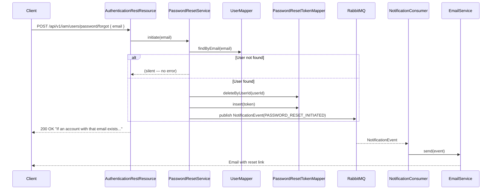
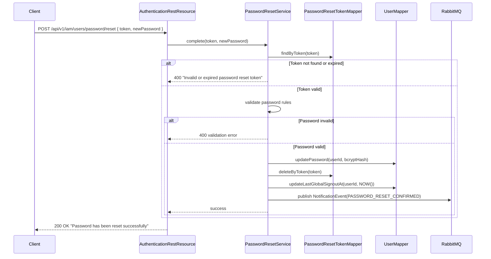

# Design Document: Identity and Access Management

## Overview

The Identity and Access Management is a production-ready, multi-tenant authentication microservice built on Spring Boot 3.x, Java 21, MyBatis 3.x, and PostgreSQL 16. It provides complete user lifecycle management including registration, JWT-based authentication (RS256), password reset, and tenant provisioning with strict data isolation.

### Core Capabilities

- **Multi-Tenancy**: All core entities in the public schema; tenant isolation enforced via `TenantMembership` bridge and `TenantContext`; MyBatis mappers route queries to `t_{tenantKey}` schemas for future tenant-scoped data
- **Authentication**: JWT RS256 tokens (access + refresh) with tenant_id claims
- **Security**: Account lockout, tenant isolation validation
- **User Management**: Registration, profile management, account deletion
- **Tenant Management**: Tenant provisioning, schema creation, status management (ACTIVE/SUSPENDED/DELETED)
- **Observability**: Structured JSON logging, distributed tracing, Prometheus metrics, health checks

### Design Principles

1. **Clean Architecture**: Vertical slice organization by feature/domain
2. **Scalability First**: Stateless design, horizontal scaling, connection pooling
3. **Cloud-Native**: 12-factor app, containerized, externalized configuration
4. **Security by Default**: JWT RS256, tenant isolation
5. **Developer Experience**: Clear patterns, comprehensive documentation, testable design
6. **Production Ready**: Health checks, graceful shutdown, observability built-in

### Technology Stack

| Category | Technology | Version | Justification |
|----------|-----------|---------|---------------|
| Language | Java | 21 | Records, pattern matching, virtual threads, text blocks |
| Framework | Spring Boot | 3.x | Industry standard, comprehensive ecosystem, production-ready |
| Persistence | MyBatis | 3.x | SQL-first, explicit query control, no ORM magic, easy multi-schema routing |
| Database | PostgreSQL | 16 | Schema-per-tenant support, ACID compliance, JSON support |
| Security | Spring Security + JWT | 6.x | OAuth2 resource server, method security, JWT RS256 |
| Migration | Liquibase | 4.x | Version control for database, multi-tenant support |
| Messaging | RabbitMQ | 3.x | Event publishing, reliable delivery, dead letter queues |
| Observability | OpenTelemetry + Prometheus | Latest | Distributed tracing, metrics, industry standards |
| API Docs | SpringDoc OpenAPI | 2.x | Automatic OpenAPI 3.0 generation, Swagger UI |
| Testing | JUnit 5 + Testcontainers | Latest | Modern testing, real database integration tests |
| Distributed Lock | ShedLock | 6.x | Prevents concurrent `@Scheduled` job execution across pods |


## System Architecture

### High-Level Architecture

```
┌─────────────────────────────────────────────────────────────────┐
│                         API Gateway                              │
│                  (Routes, Auth, Rate Limiting)                   │
└────────────────────────────┬────────────────────────────────────┘
                             │
                             │ X-Tenant-ID header / JWT tenant_id
                             ▼
┌─────────────────────────────────────────────────────────────────┐
│                   Identity and Access Management                  │
│  ┌──────────────────────────────────────────────────────────┐   │
│  │  TenantExtractionFilter (Servlet Filter)                 │   │
│  │  - Resolves tenant_id from header or JWT                 │   │
│  │  - Sets TenantContext (ThreadLocal)                      │   │
│  └──────────────────────────────────────────────────────────┘   │
│                             │                                    │
│  ┌──────────────────────────▼──────────────────────────────┐   │
│  │  SecurityFilterChain                                     │   │
│  │  - JWT validation (RS256)                                │   │
│  │  - Authority extraction                                  │   │
│  └──────────────────────────────────────────────────────────┘   │
│                             │                                    │
│  ┌──────────────────────────▼──────────────────────────────┐   │
│  │  REST Controllers (@PreAuthorize)                        │   │
│  │  - TenantRestResource, UserRestResource                  │   │
│  │  - AuthenticationRestResource                            │   │
│  └──────────────────────────────────────────────────────────┘   │
│                             │                                    │
│  ┌──────────────────────────▼──────────────────────────────┐   │
│  │  Service Layer (@Transactional)                          │   │
│  │  - TenantService, UserService, AuthenticationService     │   │
│  └──────────────────────────────────────────────────────────┘   │
│                             │                                    │
│  ┌──────────────────────────▼──────────────────────────────┐   │
│  │  MyBatis Mapper Layer                                    │   │
│  │  - TenantMapper, UserMapper, TenantMembershipMapper      │   │
│  │  - All SQL explicit in XML mapper files                  │   │
│  └──────────────────────────────────────────────────────────┘   │
│                             │                                    │
│  ┌──────────────────────────▼──────────────────────────────┐   │
│  │  Multi-Schema Routing (TenantContext)                    │   │
│  │  - MyBatisSchemaInterceptor sets search_path per query   │   │
│  │  - TenantContext provides current tenantKey              │   │
│  └──────────────────────────────────────────────────────────┘   │
└─────────────────────────────┬───────────────────────────────────┘
                              │
                              ▼
┌─────────────────────────────────────────────────────────────────┐
│                      PostgreSQL 16                               │
│  ┌──────────────────────────────────────────────────────────┐   │
│  │  public schema (all entities)                            │   │
│  │  - tenants table                                         │   │
│  │  - users table (global identity, no tenant_id)           │   │
│  │  - tenant_memberships table (user ↔ tenant bridge)       │   │
│  │  - tenant_member_authorities table (per-membership roles)│   │
│  └──────────────────────────────────────────────────────────┘   │
│  ┌──────────────────────────────────────────────────────────┐   │
│  │  t_xk7f2b9a schema (reserved, no tables currently)      │   │
│  └──────────────────────────────────────────────────────────┘   │
└─────────────────────────────────────────────────────────────────┘
```

### Multi-Tenancy Architecture

All entities reside in the **public** schema. The identity model follows the **GitHub orgs pattern**: a `User` is a global identity (email + password), and a `TenantMembership` bridge table links users to tenants with per-membership status and authorities.

1. **Global User Identity**: The `users` table holds credentials and profile — no `tenant_id` column. Email is globally unique.
2. **Tenant Membership Bridge**: The `tenant_memberships` table (`user_id` + `tenant_key` + `status`) represents a user's membership in a tenant.
3. **Per-Membership Authorities**: The `tenant_member_authorities` table holds the authority list scoped to a specific membership.
4. **Tenant Isolation via Membership**: All tenant-scoped operations resolve the membership for `(userId, tenantKey)` from `TenantContext`.
5. **MyBatis Schema Routing**: `MyBatisSchemaInterceptor` intercepts every `StatementHandler` and executes `SET search_path TO {schema}` before the statement when a tenant context is active.

### Tenant Identity: tenantKey vs name

| Field | `tenantKey` | `name` |
|-------|-------------|--------|
| Purpose | Internal identifier, used in headers, JWT claims, schema name | Human-readable display name |
| Format | 8 lowercase alphanumeric chars (NanoID, alphabet `a-z0-9`) | 1–100 characters, immutable after creation |
| Example | `xk7f2b9a` | `Acme Corporation` |
| Schema | `t_xk7f2b9a` | — |
| Mutability | Immutable after creation | Immutable after creation |
| Uniqueness | UNIQUE constraint on `tenant_key` | UNIQUE constraint on `name` |
| Exposed in | `X-Tenant-ID` header, JWT `tenant_id` claim, API responses | API responses only |

### Tenant Provisioning Flow (Fully Async via Signup + RabbitMQ)

There is no `POST /api/v1/iam/tenants` endpoint. Tenant creation is triggered inline during user signup when a `tenantName` is provided that does not yet exist.

```
POST /api/v1/iam/auth/signup  { email, password, firstName, lastName, tenantName }
        │
        ▼
1. Validate request (email, password, tenantName length)
2. Check tenantName uniqueness — if already taken return 409 "Tenant name already taken"
3. Upsert User (create if new email, reuse if existing global identity)
4. Create Tenant (NanoID tenantKey, status=PROVISIONING)
5. Create TenantMembership (userId, tenantKey, authority=TENANT_OWNER)
6. Publish TenantEvent(TENANT_CREATED, routing key tenant.created)
7. Return 201 Created { userId, email, tenantKey, tenantStatus: "PROVISIONING" }
        │
        ▼ (async, separate thread/consumer)
8. TenantProvisioningConsumer receives TenantEvent
9. Run tenant migrations: tenantLiquibaseRunner.runMigrationsForTenant(tenantKey)
   ├── SUCCESS → Update Tenant status → ACTIVE via TenantMapper.updateStatus(tenantKey, ACTIVE)
   │             Publish TenantEvent(TENANT_UPDATED)
   └── FAILURE → Update Tenant status → PROVISIONING_FAILED via TenantMapper.updateStatus(tenantKey, PROVISIONING_FAILED)
                 Log error; do NOT rethrow (message is not requeued)
```

> Signup always creates a new tenant. The registrant becomes the `TENANT_OWNER`. Joining an existing tenant requires an invitation (out of scope). The client polls `GET /api/v1/iam/tenants/{tenantKey}` to detect when status transitions to `ACTIVE` before attempting sign-in.

### Provisioning Retry Flow (PROVISIONING_FAILED → PROVISIONING)

The `StuckTenantReaperJob` marks tenants as `PROVISIONING_FAILED` when the RabbitMQ publish succeeded but the consumer never processed the message (pod crash, broker restart, etc.), or when the initial publish itself failed and the reaper caught the stuck tenant. In either case the tenant is permanently broken without a retry path.

```
POST /api/v1/iam/tenants/{tenantKey}/retry-provisioning
        │
        ▼
1. Load tenant; return 404 if not found
2. Assert tenant.status == PROVISIONING_FAILED; return 409 if not
3. Update tenant status → PROVISIONING via TenantMapper.updateStatus(tenantKey, PROVISIONING)
4. Re-publish TenantEvent(TENANT_CREATED, routing key tenant.created) via MessagingService
5. Return 202 Accepted { tenantKey, status: "PROVISIONING" }
        │
        ▼ (async, same consumer path as original signup)
6. TenantProvisioningConsumer receives TenantEvent
   ├── SUCCESS → status → ACTIVE
   └── FAILURE → status → PROVISIONING_FAILED (client can retry again)
```

The `PROVISIONING_FAILED → PROVISIONING` transition is only available through this dedicated endpoint, not through the generic `PATCH /status` endpoint, to prevent accidental misuse.


## Domain Model

### Core Domain Objects (Plain Java Classes — No ORM Annotations)

With MyBatis, domain objects are plain Java classes (or records for immutable data). No `@Entity`, `@Table`, `@Column`, `@GeneratedValue`, or any JPA/Hibernate annotations are used.

#### Tenant

```java
public class Tenant {
    private UUID id;
    private String tenantKey;   // 8-char NanoID, immutable
    private String name;        // human-readable display name, immutable after creation, UNIQUE
    private TenantStatus status;
    private LocalDateTime createdAt;
    private LocalDateTime updatedAt;
    private String createdBy;
    private String updatedBy;
    // getters + setters
}
```

#### User (Global Identity)

```java
public class User {
    private UUID id;
    private String email;       // globally unique
    private String passwordHash;
    private String firstName;
    private String lastName;
    private AccountStatus status;
    private boolean emailVerified; // defaults to false; set to true after email verification
    private Instant lastGlobalSignoutAt;  // NULL until first signout-all; invalidates all tokens with iat ≤ this value
    private LocalDateTime createdAt;
    private LocalDateTime updatedAt;
    private String createdBy;
    private String updatedBy;
    // getters + setters
}
```

#### TenantMembership (Bridge: User ↔ Tenant)

```java
public class TenantMembership {
    private UUID id;
    private UUID userId;
    private String tenantKey;
    private MembershipStatus status;
    private LocalDateTime createdAt;
    private LocalDateTime updatedAt;
    private String createdBy;
    private String updatedBy;
    // getters + setters
}
```

#### TenantMemberAuthority

```java
public class TenantMemberAuthority {
    private UUID id;
    private UUID membershipId;
    private String authority;   // MEMBER, ADMIN, TENANT_OWNER
    // getters + setters
}
```

#### EmailVerificationToken

```java
public class EmailVerificationToken {
    private UUID id;
    private UUID userId;
    private String token;         // 64-char hex, SecureRandom 32 bytes
    private Instant expiresAt;    // NOW() + 24h
    private int resendCount;      // incremented on each resend
    private Instant lastResendAt; // NULL until first resend
    private Instant createdAt;
    // getters + setters
}
```

#### TokenDenylist

```java
public class TokenDenylist {
    private UUID id;
    private String jti;
    private UUID userId;
    private Instant expiresAt;
    private Instant createdAt;
    // getters + setters
}
```

#### FailedLoginAttempt

```java
public class FailedLoginAttempt {
    private UUID id;
    private String email;
    private Instant attemptedAt;
    // getters + setters
}
```

### Enumerations

```java
public enum TenantStatus    { PROVISIONING, ACTIVE, SUSPENDED, DELETED, PROVISIONING_FAILED }
public enum AccountStatus   { ACTIVE }
public enum MembershipStatus { ACTIVE, SUSPENDED, REMOVED }
```

### Entity Relationships (enforced by SQL, not ORM)

```
tenants.tenant_key ←── tenant_memberships.tenant_key (FK, ON DELETE CASCADE)
users.id           ←── tenant_memberships.user_id    (FK, ON DELETE CASCADE)
tenant_memberships.id ←── tenant_member_authorities.membership_id (FK, ON DELETE CASCADE)
users.id           ←── token_denylist.user_id        (FK, ON DELETE CASCADE)
```


## Package Structure (Vertical Slices)

```
com.iqscaffold.iam/
├── tenant/
│   ├── Tenant.java                            # Domain object
│   ├── TenantStatus.java
│   ├── TenantMapper.java                      # MyBatis mapper interface
│   ├── TenantMapper.xml                       # SQL mapper (resources/mappers/tenant/)
│   ├── TenantService.java
│   ├── TenantServiceImpl.java
│   ├── TenantRestResource.java
│   ├── TenantProvisioningConsumer.java
│   └── dto/
│       ├── TenantDtos.java
│       └── TenantDtoMapper.java               # Manual DTO mapper (no ORM mapper)
├── user/
│   ├── User.java
│   ├── AccountStatus.java
│   ├── UserMapper.java                        # MyBatis mapper interface
│   ├── UserMapper.xml
│   ├── UserService.java
│   ├── UserServiceImpl.java
│   ├── UserRestResource.java
│   └── dto/
│       ├── UserDtos.java
│       └── UserDtoMapper.java
├── membership/
│   ├── TenantMembership.java
│   ├── TenantMemberAuthority.java
│   ├── MembershipStatus.java
│   ├── TenantMembershipMapper.java            # MyBatis mapper interface
│   ├── TenantMembershipMapper.xml
│   ├── TenantMemberAuthorityMapper.java
│   ├── TenantMemberAuthorityMapper.xml
│   ├── MembershipService.java
│   └── MembershipServiceImpl.java
├── authentication/
│   ├── AuthenticationService.java
│   ├── AuthenticationServiceImpl.java
│   ├── AuthenticationRestResource.java
│   ├── JwtTokenGenerator.java
│   └── dto/
│       ├── AuthenticationDtos.java
│       └── AuthenticationDtoMapper.java
├── config/
│   ├── SecurityConfig.java
│   ├── MyBatisConfig.java                     # SqlSessionFactory, schema interceptor
│   ├── RabbitMQConfig.java
│   ├── OpenApiConfig.java
│   ├── GlobalExceptionHandler.java
│   ├── AuthConfigurationProperties.java
│   ├── DatabaseConfigurationProperties.java
│   ├── TenancyConfigurationProperties.java
│   └── LiquibaseConfigurationProperties.java
├── security/
│   ├── JwtAuthenticationFilter.java
│   └── JwtClaimNames.java
├── tenancy/
│   ├── TenantContext.java
│   ├── TenantExtractionFilter.java
│   ├── MyBatisSchemaInterceptor.java          # Interceptor: SET search_path per statement
│   └── TenantLiquibaseRunner.java
├── infrastructure/messaging/
│   ├── MessagingService.java
│   ├── UserEventPublisher.java
│   ├── TenantEvent.java
│   ├── UserEvent.java
│   ├── NotificationEvent.java
│   ├── NotificationEventType.java
│   ├── UserEventListener.java
│   ├── NotificationConsumer.java
│   ├── EmailService.java
│   └── MessagingException.java
├── shared/exception/
│   ├── UserNotFoundException.java
│   ├── MembershipNotFoundException.java
│   ├── TenantContextMismatchException.java
│   ├── EmailAlreadyRegisteredException.java
│   ├── TenantSuspendedException.java
│   ├── TenantNotAvailableException.java
│   ├── AccountLockedException.java
│   ├── TenantMembershipAlreadyExistsException.java
│   ├── InvalidTokenTypeException.java
│   ├── TokenExpiredException.java
│   ├── InvalidTokenSignatureException.java
│   ├── PasswordResetTokenNotFoundException.java
│   └── PasswordResetRateLimitException.java
├── denylist/
│   ├── TokenDenylist.java
│   ├── TokenDenylistMapper.java
│   ├── TokenDenylistMapper.xml
│   └── TokenDenylistService.java
├── lockout/
│   ├── FailedLoginAttempt.java
│   ├── FailedLoginAttemptMapper.java
│   ├── FailedLoginAttemptMapper.xml
│   └── AccountLockoutManager.java
├── passwordreset/
│   ├── PasswordResetToken.java
│   ├── PasswordResetTokenMapper.java
│   ├── PasswordResetTokenMapper.xml
│   ├── PasswordResetService.java
│   ├── PasswordResetServiceImpl.java
│   ├── PasswordResetRestResource.java
│   ├── ExpiredPasswordResetTokenReaperJob.java
│   └── dto/
│       └── PasswordResetDtos.java
└── IamServiceApplication.java
```


## MyBatis Configuration and Multi-Schema Routing

### MyBatisConfig

```java
@Configuration
@MapperScan("com.iqscaffold.iam")
public class MyBatisConfig {

    @Bean
    public SqlSessionFactory sqlSessionFactory(final DataSource dataSource) throws Exception {
        final SqlSessionFactoryBean factory = new SqlSessionFactoryBean();
        factory.setDataSource(dataSource);
        factory.setMapperLocations(
            new PathMatchingResourcePatternResolver()
                .getResources("classpath:mappers/**/*.xml")
        );
        final org.apache.ibatis.session.Configuration config =
            new org.apache.ibatis.session.Configuration();
        config.setMapUnderscoreToCamelCase(true);
        config.addInterceptor(new MyBatisSchemaInterceptor());
        factory.setConfiguration(config);
        return factory.getObject();
    }
}
```

### MyBatisSchemaInterceptor (Schema Routing)

Replaces Hibernate's `MultiTenantConnectionProvider`. Intercepts every MyBatis statement and sets `search_path` to the tenant schema when a tenant context is active. All public-schema queries run without schema switching.

```java
@Intercepts({
    @Signature(type = StatementHandler.class, method = "prepare",
               args = {Connection.class, Integer.class})
})
public class MyBatisSchemaInterceptor implements Interceptor {

    private static final Logger log = LoggerFactory.getLogger(MyBatisSchemaInterceptor.class);

    @Override
    public Object intercept(final Invocation invocation) throws Throwable {
        final Connection connection = (Connection) invocation.getArgs()[0];
        try {
            final String tenantKey = TenantContext.getCurrentTenant();
            final String schema = "t_" + tenantKey;
            try (final Statement stmt = connection.createStatement()) {
                stmt.execute("SET search_path TO " + schema + ", public");
            }
            log.trace("search_path set to {}", schema);
        } catch (final IllegalStateException e) {
            // No tenant context — stay on public schema (system-level operations)
            log.trace("No tenant context, using public schema");
        }
        return invocation.proceed();
    }
}
```

> **Note:** The interceptor only switches `search_path` when a tenant context is present. All entity tables live in `public`, so public-schema queries work correctly in both cases. The `t_{tenantKey}` schema is reserved for future tenant-scoped tables.

### TenantContext (ThreadLocal Holder)

```java
public final class TenantContext {

    private static final ThreadLocal<String> CURRENT_TENANT = new ThreadLocal<>();

    private TenantContext() {}

    public static void setCurrentTenant(final String tenantId) {
        if (tenantId == null || tenantId.isBlank()) {
            throw new IllegalArgumentException("Tenant ID cannot be null or blank");
        }
        CURRENT_TENANT.set(tenantId);
    }

    public static String getCurrentTenant() {
        final String tenantId = CURRENT_TENANT.get();
        if (tenantId == null) {
            throw new IllegalStateException("No tenant context set for current thread");
        }
        return tenantId;
    }

    public static void clear() {
        CURRENT_TENANT.remove();
    }
}
```

### TenantExtractionFilter (Servlet Filter)

```java
@Component
@Order(Ordered.HIGHEST_PRECEDENCE + 1)
public class TenantExtractionFilter extends OncePerRequestFilter {

    private static final String TENANT_HEADER = "X-Tenant-ID";
    private final JwtDecoder jwtDecoder;

    public TenantExtractionFilter(final JwtDecoder jwtDecoder) {
        this.jwtDecoder = jwtDecoder;
    }

    @Override
    protected void doFilterInternal(final HttpServletRequest request,
                                    final HttpServletResponse response,
                                    final FilterChain filterChain)
            throws ServletException, IOException {
        try {
            final String tenantId = resolveTenantId(request);
            if (tenantId == null) {
                response.setStatus(HttpServletResponse.SC_BAD_REQUEST);
                response.setContentType("application/problem+json");
                response.getWriter().write("{\"title\":\"Tenant ID required\",\"status\":400}");
                return;
            }
            TenantContext.setCurrentTenant(tenantId);
            filterChain.doFilter(request, response);
        } finally {
            TenantContext.clear();
        }
    }

    @Override
    protected boolean shouldNotFilter(final HttpServletRequest request) {
        final String path = request.getRequestURI();
        return path.startsWith("/actuator/") ||
               path.startsWith("/api-docs/") ||
               path.startsWith("/swagger-ui/") ||
               path.equals("/api/v1/iam/auth/signup") ||        // tenant resolved from request body
               path.equals("/api/v1/iam/users/tenants") ||       // credential-gated discovery, no tenant context
               path.equals("/api/v1/iam/users/email/verify") ||  // public token verification, no tenant context
               path.equals("/api/v1/iam/users/email/resend-verification") || // public resend, no tenant context
               path.equals("/api/v1/iam/users/password/forgot") ||  // password reset initiation, no tenant context
               path.equals("/api/v1/iam/users/password/reset");     // password reset completion, no tenant context
    }

    private String resolveTenantId(final HttpServletRequest request) {
        final String header = request.getHeader(TENANT_HEADER);
        if (header != null && !header.isBlank()) return header;
        final String auth = request.getHeader("Authorization");
        if (auth != null && auth.startsWith("Bearer ")) {
            try {
                final Jwt jwt = jwtDecoder.decode(auth.substring(7));
                return jwt.getClaimAsString(JwtClaimNames.TENANT_ID);
            } catch (final JwtException e) {
                return null;
            }
        }
        return null;
    }
}
```


## MyBatis Mapper Design

### Mapper Interface Pattern

All mappers are annotated with `@Mapper` and use XML mapper files for all SQL. No inline `@Select`/`@Insert` annotations — all SQL lives in `src/main/resources/mappers/`.

### TenantMapper

```java
@Mapper
public interface TenantMapper {
    void insertIfAbsent(Tenant tenant);   // INSERT ... ON CONFLICT (name) DO NOTHING — idempotent, eliminates TOCTOU
    Optional<Tenant> findByTenantKey(String tenantKey);
    List<Tenant> findByStatus(String status);
    boolean existsByName(String name);
    void updateStatus(@Param("tenantKey") String tenantKey, @Param("status") String status);
    List<Tenant> findStuckProvisioning(@Param("olderThan") Instant olderThan);  // WHERE status='PROVISIONING' AND created_at < #{olderThan}
}
```

### UserMapper

```java
@Mapper
public interface UserMapper {
    void upsertByEmail(User user);   // INSERT ... ON CONFLICT (email) DO NOTHING — idempotent, eliminates TOCTOU
    Optional<User> findById(UUID id);
    Optional<User> findByEmail(String email);
    boolean existsByEmail(String email);
    void update(User user);
    void updateLastGlobalSignoutAt(@Param("userId") UUID userId, @Param("lastGlobalSignoutAt") Instant lastGlobalSignoutAt);
    Optional<Instant> findLastGlobalSignoutAt(@Param("userId") UUID userId);
    void setEmailVerified(@Param("userId") UUID userId);  // UPDATE users SET email_verified=true WHERE id=#{userId}
    void updatePassword(@Param("userId") UUID userId, @Param("passwordHash") String passwordHash);  // UPDATE users SET password_hash=#{passwordHash}, updated_at=NOW() WHERE id=#{userId}
}
```

### TenantMembershipMapper

```java
@Mapper
public interface TenantMembershipMapper {
    void insert(TenantMembership membership);
    Optional<TenantMembership> findByUserIdAndTenantKey(
        @Param("userId") UUID userId,
        @Param("tenantKey") String tenantKey);
    boolean existsByUserIdAndTenantKey(
        @Param("userId") UUID userId,
        @Param("tenantKey") String tenantKey);
    List<TenantMembership> findByTenantKey(String tenantKey);
    List<TenantMembership> findByUserId(UUID userId);
    void deleteById(UUID id);
}
```

### TenantMemberAuthorityMapper

```java
@Mapper
public interface TenantMemberAuthorityMapper {
    void insert(TenantMemberAuthority authority);
    List<TenantMemberAuthority> findByMembershipId(UUID membershipId);
    List<String> findAuthorityValuesByMembershipId(UUID membershipId);
    void deleteByMembershipId(UUID membershipId);
}
```

### EmailVerificationTokenMapper

```java
@Mapper
public interface EmailVerificationTokenMapper {
    void insert(EmailVerificationToken token);
    Optional<EmailVerificationToken> findByToken(String token);
    void deleteByUserId(UUID userId);           // invalidate all tokens for user on resend
    void deleteByExpiresAtBefore(Instant cutoff); // reaper cleanup
    void incrementResendCount(@Param("userId") UUID userId, @Param("now") Instant now);
    int countResendsWithinWindow(@Param("userId") UUID userId, @Param("since") Instant since);
}
```

### TokenDenylistMapper

```java
@Mapper
public interface TokenDenylistMapper {
    void insert(TokenDenylist entry);
    boolean existsByJti(String jti);
    List<TokenDenylist> findByUserId(UUID userId);
    void deleteByExpiresAtBefore(Instant cutoff);
}
```

### FailedLoginAttemptMapper

```java
@Mapper
public interface FailedLoginAttemptMapper {
    void insert(FailedLoginAttempt attempt);
    long countByEmailAndAttemptedAtAfter(
        @Param("email") String email,
        @Param("since") Instant since);
    void deleteByEmail(String email);
}

### PasswordResetTokenMapper

```java
@Mapper
public interface PasswordResetTokenMapper {
    void insert(PasswordResetToken token);
    Optional<PasswordResetToken> findByToken(String token);
    void deleteByToken(String token);
    void deleteByUserId(UUID userId);
    void deleteByExpiresAtBefore(Instant cutoff);
    int countByUserIdAndCreatedAtAfter(@Param("userId") UUID userId, @Param("since") Instant since);
}
```
```

### XML Mapper Example (TenantMapper.xml)

```xml
<?xml version="1.0" encoding="UTF-8"?>
<!DOCTYPE mapper PUBLIC "-//mybatis.org//DTD Mapper 3.0//EN"
    "http://mybatis.org/dtd/mybatis-3-mapper.dtd">
<mapper namespace="com.iqscaffold.iam.tenant.TenantMapper">

    <resultMap id="tenantResultMap" type="com.iqscaffold.iam.tenant.Tenant">
        <id     property="id"         column="id"/>
        <result property="tenantKey"  column="tenant_key"/>
        <result property="name"       column="name"/>
        <result property="status"     column="status"
                typeHandler="org.apache.ibatis.type.EnumTypeHandler"/>
        <result property="createdAt"  column="created_at"/>
        <result property="updatedAt"  column="updated_at"/>
        <result property="createdBy"  column="created_by"/>
        <result property="updatedBy"  column="updated_by"/>
    </resultMap>

    <insert id="insertIfAbsent" parameterType="com.iqscaffold.iam.tenant.Tenant">
        INSERT INTO public.tenants
            (id, tenant_key, name, status, created_at, updated_at, created_by, updated_by)
        VALUES
            (#{id}, #{tenantKey}, #{name}, #{status}, #{createdAt}, #{updatedAt},
             #{createdBy}, #{updatedBy})
        ON CONFLICT (name) DO NOTHING
    </insert>

    <select id="findByTenantKey" resultMap="tenantResultMap">
        SELECT * FROM public.tenants WHERE tenant_key = #{tenantKey}
    </select>

    <update id="updateStatus">
        UPDATE public.tenants
        SET status = #{status}, updated_at = NOW()
        WHERE tenant_key = #{tenantKey}
    </update>

</mapper>
```

### UserMapper.xml (upsert example)

```xml
    <!-- Idempotent upsert: concurrent signups with the same email are safe.
         ON CONFLICT DO NOTHING means the second concurrent insert is silently
         ignored; the caller then loads the canonical record via findByEmail. -->
    <insert id="upsertByEmail" parameterType="com.iqscaffold.iam.user.User">
        INSERT INTO public.users
            (id, email, password_hash, first_name, last_name, status, email_verified,
             created_at, updated_at, created_by, updated_by)
        VALUES
            (#{id}, #{email}, #{passwordHash}, #{firstName}, #{lastName}, #{status}, #{emailVerified},
             #{createdAt}, #{updatedAt}, #{createdBy}, #{updatedBy})
        ON CONFLICT (email) DO NOTHING
    </insert>

    <!-- Password reset: update password hash and bump updated_at -->
    <update id="updatePassword">
        UPDATE public.users SET password_hash = #{passwordHash}, updated_at = NOW() WHERE id = #{userId}
    </update>
```


## Application Configuration

### application.yml (key sections)

```yaml
spring:
  datasource:
    url: ${DB_URL:jdbc:postgresql://localhost:5432/iqscaffold}
    username: ${DB_USERNAME:iqscaffold}
    password: ${DB_PASSWORD:secret}
    hikari:
      maximum-pool-size: 20
      minimum-idle: 5
  liquibase:
    enabled: false   # managed by TenantLiquibaseRunner

mybatis:
  mapper-locations: classpath:mappers/**/*.xml
  configuration:
    map-underscore-to-camel-case: true
    default-fetch-size: 100
    default-statement-timeout: 30

iqscaffold:
  auth:
    jwt:
      private-key-path: ${JWT_PRIVATE_KEY_PATH:classpath:keys/private.pem}
      public-key-path:  ${JWT_PUBLIC_KEY_PATH:classpath:keys/public.pem}
      expiry: ${JWT_EXPIRY:PT15M}
      refresh-expiry: ${JWT_REFRESH_EXPIRY:P7D}
      issuer: iqscaffold-iam-service
    security:
      password-encoder-strength: 12
      rate-limiting:
        login-attempts: 5
        lockout-duration: PT15M
  tenancy:
    schema-prefix: t_
    default-schema: public
```

> **No `spring.jpa.*` or `hibernate.*` properties** — MyBatis does not use JPA or Hibernate.

## TenantLiquibaseRunner

Manages schema migrations without Hibernate. Uses raw JDBC to set `search_path` before running Liquibase.

```java
@Component
public class TenantLiquibaseRunner implements ApplicationRunner {

    private final DataSource dataSource;

    public TenantLiquibaseRunner(final DataSource dataSource) {
        this.dataSource = dataSource;
    }

    @Override
    public void run(final ApplicationArguments args) throws Exception {
        runMigrations("public", "db/changelog/system/master.xml");
    }

    public void runMigrationsForTenant(final String tenantKey) {
        final String schema = "t_" + tenantKey;
        runMigrations(schema, "db/changelog/tenant/master.xml");
        // Exceptions propagate to TenantProvisioningConsumer, which sets PROVISIONING_FAILED
    }

    private void runMigrations(final String schema, final String changelogPath) throws Exception {
        try (final Connection conn = dataSource.getConnection()) {
            conn.createStatement().execute("CREATE SCHEMA IF NOT EXISTS " + schema);
            conn.createStatement().execute("SET search_path TO " + schema);
            final Database db = DatabaseFactory.getInstance()
                .findCorrectDatabaseImplementation(new JdbcConnection(conn));
            db.setDefaultSchemaName(schema);
            final Liquibase liquibase = new Liquibase(
                changelogPath, new ClassLoaderResourceAccessor(), db);
            liquibase.update(new Contexts(), new LabelExpression());
        }
    }
}

## Password Reset Flow

### PasswordResetService Interface and Implementation

Password reset logic lives exclusively in `PasswordResetService` / `PasswordResetServiceImpl` in the `passwordreset/` package. The `AuthenticationService` does **not** contain `initiatePasswordReset` or `completePasswordReset` — those methods belong here. `PasswordResetRestResource` delegates to `PasswordResetService`, not `AuthenticationService`.

```java
public interface PasswordResetService {
    void initiatePasswordReset(String email);
    void completePasswordReset(String token, String newPassword);
}

@Service
@Transactional
public class PasswordResetServiceImpl implements PasswordResetService {

    private final UserMapper userMapper;
    private final PasswordResetTokenMapper passwordResetTokenMapper;
    private final BCryptPasswordEncoder passwordEncoder;
    private final MessagingService messagingService;
    private final AuthConfigurationProperties authProps;
    private final NotificationConfigurationProperties notificationProps;

    @Override
    public void initiatePasswordReset(final String email) {
        // 1. Rate-limit check: count tokens created within the rate-limit window
        userMapper.findByEmail(email).ifPresent(user -> {
            final Instant windowStart = Instant.now().minus(authProps.passwordReset().rateLimitWindow());
            final int count = passwordResetTokenMapper.countByUserIdAndCreatedAtAfter(user.getId(), windowStart);
            if (count >= authProps.passwordReset().rateLimitMaxRequests()) {
                throw new PasswordResetRateLimitException(authProps.passwordReset().rateLimitWindow().getSeconds());
            }
            // 2. Delete any existing token for this user
            passwordResetTokenMapper.deleteByUserId(user.getId());
            // 3. Generate 64-char hex token (SecureRandom 32 bytes)
            final byte[] bytes = new byte[32];
            new java.security.SecureRandom().nextBytes(bytes);
            final String token = HexFormat.of().formatHex(bytes);
            // 4. Build and insert PasswordResetToken
            final PasswordResetToken prt = new PasswordResetToken();
            prt.setId(UUID.randomUUID());
            prt.setUserId(user.getId());
            prt.setToken(token);
            prt.setExpiresAt(Instant.now().plus(authProps.passwordReset().tokenTtl()));
            prt.setCreatedAt(Instant.now());
            passwordResetTokenMapper.insert(prt);
            // 5. Publish notification
            final String resetUrl = notificationProps.baseUrl() + "/reset-password?token=" + token;
            final NotificationEvent event = new NotificationEvent();
            event.setRecipientEmail(email);
            event.setLocale("en");
            event.setType(NotificationEventType.PASSWORD_RESET_INITIATED);
            event.setPayload(Map.of("resetUrl", resetUrl, "firstName", user.getFirstName(), "token", token));
            event.setOccurredAt(Instant.now());
            messagingService.publishNotification(event);
        });
        // Always returns silently — prevents user enumeration
    }

    @Override
    public void completePasswordReset(final String token, final String newPassword) {
        // 1. Find token; throw if absent or expired
        final PasswordResetToken prt = passwordResetTokenMapper.findByToken(token)
            .filter(t -> t.getExpiresAt().isAfter(Instant.now()))
            .orElseThrow(PasswordResetTokenNotFoundException::new);
        // 2. Validate password (same rules as registration)
        validatePassword(newPassword);
        // 3. Hash with BCrypt strength 12
        final String hash = passwordEncoder.encode(newPassword);
        // 4. Update password
        userMapper.updatePassword(prt.getUserId(), hash);
        // 5. Delete the consumed token
        passwordResetTokenMapper.deleteByToken(token);
        // 6. Invalidate all existing sessions
        userMapper.updateLastGlobalSignoutAt(prt.getUserId(), Instant.now());
        // 7. Publish confirmation notification
        userMapper.findById(prt.getUserId()).ifPresent(user -> {
            final NotificationEvent event = new NotificationEvent();
            event.setRecipientEmail(user.getEmail());
            event.setLocale("en");
            event.setType(NotificationEventType.PASSWORD_RESET_CONFIRMED);
            event.setPayload(Map.of("firstName", user.getFirstName()));
            event.setOccurredAt(Instant.now());
            messagingService.publishNotification(event);
        });
    }

    private void validatePassword(final String password) {
        // Same rules as registration: 8–128 chars, upper, lower, digit, special
        if (password == null || password.length() < 8 || password.length() > 128) {
            throw new IllegalArgumentException("Password must be between 8 and 128 characters");
        }
        // Additional complexity checks omitted for brevity — same regex as signup validation
    }
}
```

### Sequence Diagrams

#### Initiation


#### Completion

```

## Security Configuration

### JwtClaimNames Constants

All JWT claim access must use these constants — never raw strings.

```java
public final class JwtClaimNames {

    // Standard claims
    public static final String SUB         = "sub";
    public static final String ISS         = "iss";
    public static final String IAT         = "iat";
    public static final String EXP         = "exp";
    public static final String JTI         = "jti";

    // Custom claims
    public static final String TYPE        = "type";
    public static final String USER_ID     = "userId";
    public static final String USERNAME    = "username";
    public static final String EMAIL       = "email";
    public static final String FIRST_NAME  = "firstName";
    public static final String LAST_NAME   = "lastName";
    public static final String TENANT_ID      = "tenant_id";
    public static final String AUTHORITIES    = "authorities";
    public static final String EMAIL_VERIFIED = "email_verified";

    // Token type values
    public static final String TYPE_ACCESS  = "access";
    public static final String TYPE_REFRESH = "refresh";

    // Issuer
    public static final String ISSUER = "iqscaffold-iam-service";

    private JwtClaimNames() {}
}
```

### SecurityConfig

```java
@Configuration
@EnableMethodSecurity
public class SecurityConfig {

    private final AuthConfigurationProperties authProps;

    public SecurityConfig(final AuthConfigurationProperties authProps) {
        this.authProps = authProps;
    }

    @Bean
    public SecurityFilterChain securityFilterChain(final HttpSecurity http) throws Exception {
        return http
            .sessionManagement(s -> s.sessionCreationPolicy(SessionCreationPolicy.STATELESS))
            .csrf(AbstractHttpConfigurer::disable)
            .authorizeHttpRequests(auth -> auth
                .requestMatchers(
                    "/actuator/**", "/api-docs/**", "/swagger-ui/**",
                    "/api/v1/iam/auth/signup", "/api/v1/iam/users/tenants",
                    "/api/v1/iam/auth/signin", "/api/v1/iam/auth/refresh", "/api/v1/iam/auth/validate",
                    "/api/v1/iam/users/email/verify", "/api/v1/iam/users/email/resend-verification",
                    "/api/v1/iam/users/password/forgot", "/api/v1/iam/users/password/reset"
                ).permitAll()
                .requestMatchers(HttpMethod.GET, "/api/v1/iam/tenants/**").hasAuthority("TENANT_OWNER")
                .requestMatchers(HttpMethod.PATCH, "/api/v1/iam/tenants/**").hasAuthority("TENANT_OWNER")
                .anyRequest().authenticated()
            )
            .oauth2ResourceServer(oauth2 -> oauth2
                .jwt(jwt -> jwt.decoder(jwtDecoder())
                    .jwtAuthenticationConverter(jwtAuthConverter())))
            .build();
    }

    @Bean
    public NimbusJwtDecoder jwtDecoder() {
        // Load RSA public key from authProps.jwt().publicKeyPath()
        return NimbusJwtDecoder.withPublicKey(loadPublicKey()).build();
    }

    @Bean
    public BCryptPasswordEncoder passwordEncoder() {
        return new BCryptPasswordEncoder(authProps.security().passwordEncoderStrength());
    }
}
```


## Email Verification Design

### Flow

```
POST /api/v1/iam/auth/signup
  → user created (email_verified=false)
  → EmailVerificationToken generated (SecureRandom 32 bytes → 64-char hex, TTL 24h)
  → stored in email_verification_tokens
  → NotificationEvent(VERIFY_EMAIL, recipientEmail, token) published to iqscaffold.events
  → email worker (out of scope) sends link: https://app.example.com/verify-email?token=<hex>
  → frontend extracts token from URL, calls POST /api/v1/iam/users/email/verify{ token }

POST /api/v1/iam/users/email/verify { token }
  → look up token in email_verification_tokens
  → if not found or expires_at < NOW() → 400 "Invalid or expired verification token"
  → UserMapper.setEmailVerified(userId)
  → EmailVerificationTokenMapper.deleteByUserId(userId)
  → 200 OK

POST /api/v1/iam/users/email/resend-verification  { email }
  → always 202 Accepted (prevents enumeration)
  → find user by email; if not found or already verified → return silently
  → count resends within last hour via countResendsWithinWindow; if >= 3 → 429 with Retry-After
  → EmailVerificationTokenMapper.deleteByUserId(userId)
  → generate new token, insert
  → publish NotificationEvent(VERIFY_EMAIL)
```

### EmailVerificationToken Domain Object

```java
public class EmailVerificationToken {
    private UUID id;
    private UUID userId;
    private String token;         // 64-char hex, SecureRandom 32 bytes → never UUID
    private Instant expiresAt;    // createdAt + 24h
    private int resendCount;      // 0 on creation, incremented on each resend
    private Instant lastResendAt; // NULL until first resend
    private Instant createdAt;
    // getters + setters
}
```

### EmailVerificationTokenMapper

```java
@Mapper
public interface EmailVerificationTokenMapper {
    void insert(EmailVerificationToken token);
    Optional<EmailVerificationToken> findByToken(String token);
    void deleteByUserId(UUID userId);
    void deleteByExpiresAtBefore(Instant cutoff);
    int countResendsWithinWindow(@Param("userId") UUID userId, @Param("since") Instant since);
}
```

### Gating email_verified in JWT

`JwtTokenGenerator.generateAccessToken` includes `email_verified` claim from `user.isEmailVerified()`.

Endpoints gated behind `email_verified = true` use `@PreAuthorize`:

```java
@PreAuthorize("hasAuthority('TENANT_OWNER') and #jwt.claims['email_verified'] == true")
```

Or a dedicated `EmailVerifiedFilter` that checks the claim and returns 403 with `{"title":"Email address not verified","status":403}` for the gated paths.

### NotificationEvent Types

```java
public enum NotificationEventType {
    VERIFY_EMAIL,
    EMAIL_VERIFIED,
    PASSWORD_RESET_INITIATED,
    PASSWORD_RESET_CONFIRMED
}
```

`NotificationEvent` gains a `type` field of `NotificationEventType`. The `NotificationConsumer` within this service consumes from `iqscaffold.notifications` queue and dispatches based on type.

### ExpiredVerificationTokenReaperJob

```java
@Component
public class ExpiredVerificationTokenReaperJob {

    @Scheduled(cron = "0 0 * * * *")
    @SchedulerLock(name = "ExpiredVerificationTokenReaperJob.cleanup",
                   lockAtMostFor = "PT55M", lockAtLeastFor = "PT5M")
    public void cleanup() {
        emailVerificationTokenMapper.deleteByExpiresAtBefore(Instant.now());
    }
}
```

### Database Table

```sql
email_verification_tokens (
  id             UUID PRIMARY KEY,
  user_id        UUID NOT NULL REFERENCES users(id) ON DELETE CASCADE,
  token          VARCHAR(64) UNIQUE NOT NULL,
  expires_at     TIMESTAMP NOT NULL,
  resend_count   INT NOT NULL DEFAULT 0,
  last_resend_at TIMESTAMP NULL,
  created_at     TIMESTAMP NOT NULL
)
-- indexes:
idx_email_verification_tokens_token    (token)      -- lookup by token
idx_email_verification_tokens_user_id  (user_id)    -- delete by user
idx_email_verification_tokens_expires_at (expires_at) -- reaper
```

## Token Denylist Design

### TokenDenylistService

```java
@Component
public class TokenDenylistService {

    private final TokenDenylistMapper tokenDenylistMapper;

    public TokenDenylistService(final TokenDenylistMapper tokenDenylistMapper) {
        this.tokenDenylistMapper = tokenDenylistMapper;
    }

    public void denyToken(final String jti, final UUID userId, final Instant expiresAt) {
        final TokenDenylist entry = new TokenDenylist();
        entry.setId(UUID.randomUUID());
        entry.setJti(jti);
        entry.setUserId(userId);
        entry.setExpiresAt(expiresAt);
        entry.setCreatedAt(Instant.now());
        tokenDenylistMapper.insert(entry);
    }

    public boolean isRevoked(final String jti) {
        return tokenDenylistMapper.existsByJti(jti);
    }

    @Scheduled(cron = "0 0 * * * *")
    @SchedulerLock(name = "TokenDenylistService.cleanupExpired",
                   lockAtMostFor = "PT55M", lockAtLeastFor = "PT5M")
    public void cleanupExpired() {
        tokenDenylistMapper.deleteByExpiresAtBefore(Instant.now());
    }
}
```

### ShedLock Configuration

ShedLock uses a `shedlock` table in PostgreSQL as its distributed lock store. One pod acquires the lock; the others skip execution for that cycle.

```java
@Configuration
@EnableSchedulerLock(defaultLockAtMostFor = "PT55M")
public class ShedLockConfig {

    @Bean
    public LockProvider lockProvider(final DataSource dataSource) {
        return new JdbcTemplateLockProvider(
            JdbcTemplateLockProvider.Configuration.builder()
                .withJdbcTemplate(new JdbcTemplate(dataSource))
                .usingDbTime()   // use DB clock, not pod clock
                .build()
        );
    }
}
```

The `shedlock` table is created via a Liquibase system migration:

```sql
CREATE TABLE shedlock (
    name       VARCHAR(64)  NOT NULL,
    lock_until TIMESTAMP    NOT NULL,
    locked_at  TIMESTAMP    NOT NULL,
    locked_by  VARCHAR(255) NOT NULL,
    PRIMARY KEY (name)
);
```

> `usingDbTime()` ensures all pods compare against the same database clock, avoiding skew from pod clock drift.

### StuckTenantReaperJob

Guards against tenants permanently stuck in `PROVISIONING` due to JVM crash, pod restart, or message loss before `TenantProvisioningConsumer` begins processing. Runs every 5 minutes; only one pod executes per cycle via ShedLock.

```java
@Component
public class StuckTenantReaperJob {

    private static final Logger log = LoggerFactory.getLogger(StuckTenantReaperJob.class);

    private final TenantMapper tenantMapper;
    private final TenancyConfigurationProperties tenancyProps;

    public StuckTenantReaperJob(final TenantMapper tenantMapper,
                                final TenancyConfigurationProperties tenancyProps) {
        this.tenantMapper = tenantMapper;
        this.tenancyProps = tenancyProps;
    }

    @Scheduled(cron = "0 */5 * * * *")
    @SchedulerLock(name = "StuckTenantReaperJob.reapStuckTenants",
                   lockAtMostFor = "PT4M", lockAtLeastFor = "PT1M")
    public void reapStuckTenants() {
        final Instant cutoff = Instant.now().minus(tenancyProps.provisioningTimeout());
        final List<Tenant> stuck = tenantMapper.findStuckProvisioning(cutoff);
        if (stuck.isEmpty()) return;
        log.warn("Reaper found {} tenant(s) stuck in PROVISIONING older than {}",
                 stuck.size(), tenancyProps.provisioningTimeout());
        for (final Tenant tenant : stuck) {
            tenantMapper.updateStatus(tenant.getTenantKey(), TenantStatus.PROVISIONING_FAILED.name());
            log.error("Tenant {} marked PROVISIONING_FAILED by reaper (created_at={})",
                      tenant.getTenantKey(), tenant.getCreatedAt());
        }
    }
}
```

The `TenantMapper.xml` query for `findStuckProvisioning`:

```xml
<select id="findStuckProvisioning" resultMap="tenantResultMap">
    SELECT * FROM public.tenants
    WHERE status = 'PROVISIONING'
      AND created_at &lt; #{olderThan}
</select>
```

The `provisioningTimeout` is added to `TenancyConfigurationProperties`:

```yaml
iqscaffold:
  tenancy:
    schema-prefix: t_
    default-schema: public
    provisioning-timeout: PT10M   # tenants stuck in PROVISIONING longer than this are failed by the reaper
```

### JwtAuthenticationFilter

Checks both the token denylist (JTI-based) and the global signout timestamp (`iat`-based) on every authenticated request. Registered before `BearerTokenAuthenticationFilter` in `SecurityConfig`.

```java
@Component
public class JwtAuthenticationFilter extends OncePerRequestFilter {

    private static final Logger log = LoggerFactory.getLogger(JwtAuthenticationFilter.class);

    private final JwtDecoder jwtDecoder;
    private final TokenDenylistService tokenDenylistService;
    private final UserMapper userMapper;

    public JwtAuthenticationFilter(final JwtDecoder jwtDecoder,
                                   final TokenDenylistService tokenDenylistService,
                                   final UserMapper userMapper) {
        this.jwtDecoder = jwtDecoder;
        this.tokenDenylistService = tokenDenylistService;
        this.userMapper = userMapper;
    }

    @Override
    protected void doFilterInternal(final HttpServletRequest request,
                                    final HttpServletResponse response,
                                    final FilterChain filterChain)
            throws ServletException, IOException {
        final String auth = request.getHeader("Authorization");
        if (auth != null && auth.startsWith("Bearer ")) {
            try {
                final Jwt jwt = jwtDecoder.decode(auth.substring(7));
                if (isRevoked(jwt)) {
                    response.setStatus(HttpServletResponse.SC_UNAUTHORIZED);
                    response.setContentType("application/problem+json");
                    response.getWriter().write("{\"title\":\"Token revoked\",\"status\":401}");
                    return;
                }
            } catch (final JwtException e) {
                log.debug("JWT decode failed in revocation filter: {}", e.getMessage());
            }
        }
        filterChain.doFilter(request, response);
    }

    private boolean isRevoked(final Jwt jwt) {
        // Check 1: explicit JTI denylist (covers regular signout)
        final String jti = jwt.getId();
        if (jti != null && tokenDenylistService.isRevoked(jti)) {
            return true;
        }
        // Check 2: global signout timestamp — invalidates ALL tokens issued before signout-all
        final String userIdClaim = jwt.getClaimAsString(JwtClaimNames.USER_ID);
        if (userIdClaim != null) {
            final UUID userId = UUID.fromString(userIdClaim);
            final Instant issuedAt = jwt.getIssuedAt();
            return userMapper.findLastGlobalSignoutAt(userId)
                .map(lastSignout -> issuedAt != null && !issuedAt.isAfter(lastSignout))
                .orElse(false);
        }
        return false;
    }

    @Override
    protected boolean shouldNotFilter(final HttpServletRequest request) {
        final String path = request.getRequestURI();
        return path.startsWith("/actuator/") ||
               path.startsWith("/api-docs/") ||
               path.startsWith("/swagger-ui/") ||
               path.equals("/api/v1/iam/auth/signin") ||
               path.equals("/api/v1/iam/auth/signup") ||
               path.equals("/api/v1/iam/users/tenants") ||
               path.equals("/api/v1/iam/auth/refresh");
    }
}
```

## RabbitMQ Infrastructure Design

### Exchange and Queue Topology

```
iqscaffold.events (topic exchange, durable)
  ├── routing: tenant.created  → iqscaffold.tenant.provisioning (queue)
  ├── routing: tenant.updated  → iqscaffold.user.events (queue)
  ├── routing: user.#          → iqscaffold.user.events (queue)
  └── routing: notification.*  → iqscaffold.notifications (queue)

iqscaffold.dlx (dead-letter exchange, topic)
  └── routing: #               → iqscaffold.dlq (dead-letter queue)

All queues: x-dead-letter-exchange=iqscaffold.dlx, x-message-ttl=86400000 (24h)
```

### MessagingService

```java
@Service
public class MessagingService {

    private final RabbitTemplate rabbitTemplate;

    public MessagingService(final RabbitTemplate rabbitTemplate) {
        this.rabbitTemplate = rabbitTemplate;
    }

    public void publishTenantCreated(final String tenantKey, final String tenantName) {
        final TenantEvent event = new TenantEvent(tenantKey, tenantName,
            TenantEvent.EventType.TENANT_CREATED, Instant.now());
        try {
            rabbitTemplate.convertAndSend(RabbitMQConfig.EVENTS_EXCHANGE, "tenant.created", event);
        } catch (final AmqpException e) {
            throw new MessagingException("Failed to publish tenant.created event", e);
        }
    }

    public void publishTenantUpdated(final String tenantKey) {
        final TenantEvent event = new TenantEvent(tenantKey, null,
            TenantEvent.EventType.TENANT_UPDATED, Instant.now());
        try {
            rabbitTemplate.convertAndSend(RabbitMQConfig.EVENTS_EXCHANGE, "tenant.updated", event);
        } catch (final AmqpException e) {
            throw new MessagingException("Failed to publish tenant.updated event", e);
        }
    }
}
```

## Notification and Email Design

### Overview

`NotificationConsumer` listens on `iqscaffold.notifications` within this service (Option B). Failed deliveries route to `iqscaffold.dlq` via the dead-letter exchange — no message is lost. The email worker is not a separate service.

### Package Structure

```
infrastructure/messaging/
├── NotificationConsumer.java       @RabbitListener(iqscaffold.notifications)
├── NotificationEvent.java          payload: recipientEmail, locale, type, payload, occurredAt
├── NotificationEventType.java      enum: VERIFY_EMAIL
└── EmailService.java               JavaMailSender + Thymeleaf + i18n

resources/
├── templates/email/
│   └── signup/
│       └── verify-email.html       Thymeleaf HTML template
└── messages.properties             Default (English) — all keys
    messages_es.properties          Spanish
    messages_it.properties          Italian
    messages_hu.properties          Hungarian
    (add more locales as needed)
```

### NotificationEvent

```java
public class NotificationEvent {
    private String recipientEmail;
    private String locale;               // BCP 47 tag, e.g. "en", "hu" — defaults to "en"
    private NotificationEventType type;
    private Map<String, Object> payload; // template variables
    private Instant occurredAt;
}

public enum NotificationEventType { VERIFY_EMAIL, EMAIL_VERIFIED, PASSWORD_RESET_INITIATED, PASSWORD_RESET_CONFIRMED }
```

### NotificationConsumer

```java
@Component
public class NotificationConsumer {

    private static final Logger log = LoggerFactory.getLogger(NotificationConsumer.class);
    private final EmailService emailService;

    @RabbitListener(queues = RabbitMQConfig.NOTIFICATIONS_QUEUE)
    public void handleNotification(final NotificationEvent event) {
        try {
            emailService.send(event);
        } catch (final Exception e) {
            // Log and swallow — RabbitMQ routes to DLQ after x-death TTL
            log.error("Failed to send notification type={} to={}: {}",
                      event.getType(), event.getRecipientEmail(), e.getMessage(), e);
        }
    }
}
```

### EmailService

```java
@Service
public class EmailService {

    private final JavaMailSender mailSender;
    private final TemplateEngine templateEngine;   // Thymeleaf
    private final MessageSource messageSource;
    private final NotificationConfigurationProperties notificationProps;

    public void send(final NotificationEvent event) throws MessagingException {
        final Locale locale = resolveLocale(event.getLocale());
        final String templateName = resolveTemplate(event.getType());
        final String subject = messageSource.getMessage(
            subjectKey(event.getType()), null, locale);

        final Context ctx = new Context(locale);
        ctx.setVariables(event.getPayload());
        ctx.setVariable("baseUrl", notificationProps.baseUrl());
        final String html = templateEngine.process(templateName, ctx);

        final MimeMessage msg = mailSender.createMimeMessage();
        final MimeMessageHelper helper = new MimeMessageHelper(msg, true, "UTF-8");
        helper.setFrom(notificationProps.mail().from());
        if (notificationProps.mail().replyTo() != null) {
            helper.setReplyTo(notificationProps.mail().replyTo());
        }
        helper.setTo(event.getRecipientEmail());
        helper.setSubject(subject);
        helper.setText(html, true);
        mailSender.send(msg);
    }

    private Locale resolveLocale(final String tag) {
        if (tag == null || tag.isBlank()) {
            return Locale.forLanguageTag(notificationProps.defaultLocale());
        }
        return Locale.forLanguageTag(tag);
    }

    private static String resolveTemplate(final NotificationEventType type) {
        return switch (type) {
            case VERIFY_EMAIL              -> "email/signup/verify-email";
            case EMAIL_VERIFIED            -> "email/signup/email-verified";
            case PASSWORD_RESET_INITIATED  -> "email/password-reset/initiate";
            case PASSWORD_RESET_CONFIRMED  -> "email/password-reset/confirmed";
        };
    }

    private static String subjectKey(final NotificationEventType type) {
        return switch (type) {
            case VERIFY_EMAIL              -> "email.verify-email.subject";
            case EMAIL_VERIFIED            -> "email.email-verified.subject";
            case PASSWORD_RESET_INITIATED  -> "email.password-reset.initiate.subject";
            case PASSWORD_RESET_CONFIRMED  -> "email.password-reset.confirmed.subject";
        };
    }
}
```

### i18n Properties

`src/main/resources/messages.properties` (default — English, used when no locale match):
```properties
email.verify-email.subject=Verify your email address
email.verify-email.greeting=Hi {0},
email.verify-email.body=Please verify your email address by clicking the button below. The link expires in {1} hours.
email.verify-email.cta=Verify Email
email.verify-email.ignore=If you did not create an account, you can safely ignore this email.

email.email-verified.subject=Your email has been verified
email.email-verified.greeting=Hi {0},
email.email-verified.body=Your email address has been successfully verified. You can now sign in.
email.email-verified.cta=Sign In
```

`src/main/resources/messages_es.properties`:
```properties
email.verify-email.subject=Verifica tu dirección de correo electrónico
email.verify-email.greeting=Hola {0},
email.verify-email.body=Por favor, verifica tu dirección de correo haciendo clic en el botón de abajo. El enlace caduca en {1} horas.
email.verify-email.cta=Verificar correo
email.verify-email.ignore=Si no creaste una cuenta, puedes ignorar este correo.

email.email-verified.subject=Tu correo ha sido verificado
email.email-verified.greeting=Hola {0},
email.email-verified.body=Tu dirección de correo ha sido verificada correctamente. Ya puedes iniciar sesión.
email.email-verified.cta=Iniciar sesión
```

`src/main/resources/messages_it.properties`:
```properties
email.verify-email.subject=Verifica il tuo indirizzo email
email.verify-email.greeting=Ciao {0},
email.verify-email.body=Verifica il tuo indirizzo email cliccando il pulsante qui sotto. Il link scade tra {1} ore.
email.verify-email.cta=Verifica email
email.verify-email.ignore=Se non hai creato un account, puoi ignorare questa email.

email.email-verified.subject=La tua email è stata verificata
email.email-verified.greeting=Ciao {0},
email.email-verified.body=Il tuo indirizzo email è stato verificato con successo. Ora puoi accedere.
email.email-verified.cta=Accedi
```

`src/main/resources/messages_hu.properties`:
```properties
email.verify-email.subject=Erősítsd meg az e-mail címed
email.verify-email.greeting=Szia {0},
email.verify-email.body=Kérjük, erősítsd meg az e-mail címed az alábbi gombra kattintva. A link {1} óráig érvényes.
email.verify-email.cta=E-mail megerősítése
email.verify-email.ignore=Ha nem te hoztad létre a fiókot, nyugodtan hagyd figyelmen kívül ezt az e-mailt.

email.email-verified.subject=Az e-mail címed megerősítve
email.email-verified.greeting=Szia {0},
email.email-verified.body=Az e-mail címed sikeresen megerősítve. Most már bejelentkezhetsz.
email.email-verified.cta=Bejelentkezés
```

Adding a new language requires only a new `messages_<lang>.properties` file — no code changes.

### Thymeleaf Template (`signup/verify-email.html`)

```html
<!DOCTYPE html>
<html xmlns:th="http://www.thymeleaf.org" th:lang="${#locale.language}">
<head>
  <meta charset="UTF-8"/>
  <title th:text="#{email.verify-email.subject}">Verify your email</title>
</head>
<body>
  <p th:text="#{email.verify-email.greeting(${firstName})}">Hi,</p>
  <p th:text="#{email.verify-email.body(${expiresInHours})}">Please verify...</p>
  <a th:href="${verificationUrl}" th:text="#{email.verify-email.cta}">Verify Email</a>
  <p th:text="#{email.verify-email.ignore}">If you did not...</p>
</body>
</html>
```

The `verificationUrl` is built by the caller as `notificationProps.baseUrl() + "/verify-email?token=" + token`.

### Thymeleaf Template (`signup/email-verified.html`)

```html
<!DOCTYPE html>
<html xmlns:th="http://www.thymeleaf.org" th:lang="${#locale.language}">
<head>
  <meta charset="UTF-8"/>
  <title th:text="#{email.email-verified.subject}">Email verified</title>
</head>
<body>
  <p th:text="#{email.email-verified.greeting(${firstName})}">Hi,</p>
  <p th:text="#{email.email-verified.body}">Your email has been verified.</p>
  <a th:href="${signinUrl}" th:text="#{email.email-verified.cta}">Sign In</a>
</body>
</html>
```

The `signinUrl` is built by the caller as `notificationProps.baseUrl() + "/signin"`.

### NotificationConfigurationProperties

```java
@ConfigurationProperties("iqscaffold.notification")
public record NotificationConfigurationProperties(
    Mail mail,
    String defaultLocale,   // default: "en"
    String baseUrl          // e.g. "https://app.example.com"
) {
    public record Mail(String from, String replyTo) {}
}
```

### application.yml additions

```yaml
iqscaffold:
  notification:
    mail:
      from: ${MAIL_FROM:noreply@example.com}
      reply-to: ${MAIL_REPLY_TO:}
    default-locale: en
    base-url: ${APP_BASE_URL:http://localhost:3000}

spring:
  mail:
    host: ${MAIL_HOST:localhost}
    port: ${MAIL_PORT:587}
    username: ${MAIL_USERNAME:}
    password: ${MAIL_PASSWORD:}
    properties:
      mail.smtp.auth: true
      mail.smtp.starttls.enable: true
  thymeleaf:
    prefix: classpath:/templates/
    suffix: .html
    mode: HTML
    encoding: UTF-8
    cache: true   # set false in local profile
  messages:
    basename: messages
    encoding: UTF-8
    fallback-to-system-locale: false
```

`application-local.yml` overrides (Mailpit on port 1025):
```yaml
spring:
  mail:
    host: localhost
    port: 1025
    properties:
      mail.smtp.auth: false
      mail.smtp.starttls.enable: false
  thymeleaf:
    cache: false
```

### MessageSource Bean

```java
@Bean
public MessageSource messageSource() {
    final ReloadableResourceBundleMessageSource ms =
        new ReloadableResourceBundleMessageSource();
    ms.setBasename("classpath:messages");  // resolves messages.properties, messages_es.properties, etc.
    ms.setDefaultEncoding("UTF-8");
    ms.setCacheSeconds(3600);
    ms.setFallbackToSystemLocale(false);   // fall back to messages.properties (English), not JVM locale
    return ms;
}
```

## API Endpoint Summary

| Method | Path | Auth | Description |
|--------|------|------|-------------|
| GET | /api/v1/iam/tenants/{tenantKey} | TENANT_OWNER | Get tenant status (200) |
| PATCH | /api/v1/iam/tenants/{tenantKey}/status | TENANT_OWNER | Update tenant status (200) |
| POST | /api/v1/iam/tenants/{tenantKey}/retry-provisioning | TENANT_OWNER | Retry a PROVISIONING_FAILED tenant (202) |
| POST | /api/v1/iam/auth/signup | Public | Register user + create tenant (201) |
| POST | /api/v1/iam/users/email/verify| Public | Verify email with token (200) |
| POST | /api/v1/iam/users/email/resend-verification | Public | Resend verification email (202) |
| POST | /api/v1/iam/users/password/forgot | Public | Request password reset link (200) |
| POST | /api/v1/iam/users/password/reset | Public | Submit new password with one-time token (200) |
| POST | /api/v1/iam/users/tenants | Public | List user's active tenants (200) — credential-gated, no token issued |
| POST | /api/v1/iam/auth/signin | Public | Sign in to a specific tenant (200) |
| POST | /api/v1/iam/auth/refresh | Public | Refresh tokens (200) |
| POST | /api/v1/iam/auth/signout | Authenticated | Sign out (204) |
| POST | /api/v1/iam/auth/signout-all | Authenticated | Sign out all sessions (204) |
| POST | /api/v1/iam/auth/validate | Public | Validate token (200) |
| GET | /api/v1/iam/users/me | Authenticated | Get profile (200) |
| PATCH | /api/v1/iam/users/me | Authenticated | Update profile (200) |
| DELETE | /api/v1/iam/users/me | Authenticated | Delete membership (204) |

All tenant-scoped endpoints require `X-Tenant-ID` header or JWT `tenant_id` claim.

> **Soft-delete semantics**: Setting a tenant to `DELETED` marks the record and blocks all authentication for that tenant, but does NOT drop the `t_{tenantKey}` schema or purge membership rows. This is intentional — data is retained for auditability. Schema cleanup (`DROP SCHEMA t_{tenantKey} CASCADE`) and hard-delete of membership data are out of scope for this implementation and must be handled by a separate administrative process.

## Error Response Format (RFC 9457 ProblemDetail)

## Exception Hierarchy

All custom exceptions extend `RuntimeException` unless noted. The `GlobalExceptionHandler` (`@RestControllerAdvice`) maps each to an RFC 9457 `ProblemDetail` response.

### Authentication & Token Exceptions (→ 401)

| Exception | HTTP | Message |
|-----------|------|---------|
| `InvalidTokenTypeException` | 401 | "Invalid token type" — JWT `type` claim is not `"refresh"` during token refresh |
| `TokenExpiredException` | 401 | "Refresh token expired" — refresh token past its `exp` claim |
| `InvalidTokenSignatureException` | 401 | "Invalid token signature" — RS256 signature verification failed |

### Authorization Exceptions (→ 403)

| Exception | HTTP | Message |
|-----------|------|---------|
| `MembershipNotFoundException` | 403 | "User is not a member of this tenant" — no `TenantMembership` for `(userId, tenantKey)` |
| `TenantContextMismatchException` | 403 | "Tenant context mismatch" — `tenant_id` in refresh token ≠ `TenantContext.getCurrentTenant()` |
| `TenantSuspendedException` | 403 | "Tenant suspended" — tenant status is `SUSPENDED` |
| `TenantNotAvailableException` | 403 | "Tenant not available" — tenant status is `DELETED` or `PROVISIONING_FAILED` |
| `AccountLockedException` | 403 | "Account temporarily locked" — failed login attempts exceeded threshold |

### Not Found Exceptions (→ 404)

| Exception | HTTP | Message |
|-----------|------|---------|
| `UserNotFoundException` | 404 | "User not found" |
| `TenantNotFoundException` (subtype of `TenantManagementException`) | 404 | "Tenant not found" |

### Conflict Exceptions (→ 409)

| Exception | HTTP | Message |
|-----------|------|---------|
| `UserRegistrationException` | 409 | Duplicate email or other registration conflict |
| `TenantAlreadyExistsException` (subtype of `TenantManagementException`) | 409 | "Tenant name already taken" |
| `TenantMembershipAlreadyExistsException` | 409 | "User is already a member of this tenant" |
| `InvalidTenantStateException` (subtype of `TenantManagementException`) | 409 | "Tenant is not in PROVISIONING_FAILED state" |

### Validation Exceptions (→ 400)

| Exception | HTTP | Message |
|-----------|------|---------|
| `InvalidVerificationTokenException` | 400 | "Invalid or expired verification token" |
| `PasswordResetTokenNotFoundException` | 400 | "Invalid or expired password reset token" |
| `EmailAlreadyRegisteredException` | 400 | "Email already registered" |

### Rate Limit Exceptions (→ 429)

| Exception | HTTP | Notes |
|-----------|------|-------|
| `VerificationRateLimitException` | 429 | Carries `retryAfterSeconds: long`; handler sets `Retry-After` response header |
| `PasswordResetRateLimitException` | 429 | Carries `retryAfterSeconds: long`; handler sets `Retry-After` response header |

### Sealed Hierarchy

```java
public sealed class TenantManagementException extends RuntimeException
    permits TenantAlreadyExistsException,
            TenantNotFoundException,
            SchemaProvisioningException,   // → 503
            InvalidTenantStateException {  // → 409
}
```

`SchemaProvisioningException` maps to 503 Service Unavailable — used when `TenantLiquibaseRunner` fails to apply migrations.

### Other

| Exception | HTTP | Notes |
|-----------|------|-------|
| `UserManagementException` | 422 | General user update/delete failure |
| `MessagingException` | 503 | Wraps `AmqpException`; thrown by `MessagingService` when RabbitMQ publish fails |


```json
{
  "type": "https://iqscaffold.com/errors/membership-not-found",
  "title": "User is not a member of this tenant",
  "status": 403,
  "detail": "No active membership found for user in tenant xk7f2b9a",
  "instance": "/api/v1/iam/users/me",
  "correlationId": "550e8400-e29b-41d4-a716-446655440000",
  "requestId": "req-a1b2c3d4"
}
```

Validation errors include a `fields` array:
```json
{
  "type": "https://iqscaffold.com/errors/validation",
  "title": "Validation failed",
  "status": 400,
  "fields": [
    { "field": "email", "message": "must be a well-formed email address" },
    { "field": "password", "message": "size must be between 8 and 128" }
  ]
}
```
